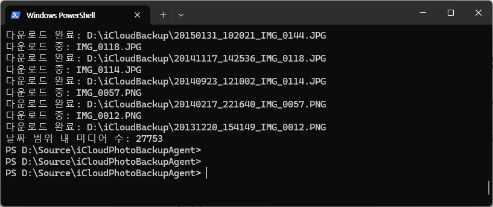

# iCloudPhotoBackupAgent 📸

<div align="center">


</div>

## 📝 Description

iCloudPhotoBackupAgent는 iCloud에 저장된 사진과 동영상을 로컬 컴퓨터로 쉽게 백업할 수 있는 pyicloud(0.10.2) 기반 애플리케이션입니다. 2단계 인증(MFA)도 지원합니다.

pyicloud 사랑해요❤️<br>
https://pypi.org/project/pyicloud/

## ✨ Features

- 📱 iCloud 사진 및 동영상 백업
- 🔐 2단계 인증(MFA) 지원
- 📅 날짜 기반 필터링
- 📂 자동 파일명 관리
- ⏱️ 진행 상황 모니터링

## 🚀 Getting Started

### Prerequisites

- Python 3.13.3
- pyicloud 0.10.2

### Installation

1. 저장소를 클론합니다:
```bash
git clone https://github.com/rokag3-gb/iCloudPhotoBackupAgent.git
cd iCloudPhotoBackupAgent
```

2. 필요한 패키지를 설치합니다:
```bash
pip install -r requirements.txt
```

### Usage

애플리케이션을 실행합니다:
```bash
python main.py
```

다양한 형태로 argument를 추가하여 사용할 수 있습니다. --start-date와 --end-date은 KST 기준 입니다. --download-dir 은 생략 시 './downloaded_photos' 으로 인식됩니다.

```bash
python main.py --username {username}

python main.py --username {username} --password {password}

python main.py --username {username} --password {password} --start-date {yyyy-MM-dd} --end-date {yyyy-MM-dd}

python main.py --username {username} --password {password} --start-date {yyyy-MM-dd} --end-date {yyyy-MM-dd} --download-dir {download-dir}
```

작동한 결과 모습




## 📦 Dependencies

- pyicloud==0.10.2 (MIT License)
  - Copyright (c) 2015 PickledBrain
  - https://github.com/pickledbrain/pyicloud

## 🤝 Contributing

프로젝트에 기여하고 싶으시다면 Pull Request를 보내주세요. 모든 기여를 환영합니다!

## 📄 License

이 프로젝트는 MIT 라이선스 하에 배포됩니다.

---

<div align="center">
Made with ❤️ by rokag3-gb
</div>